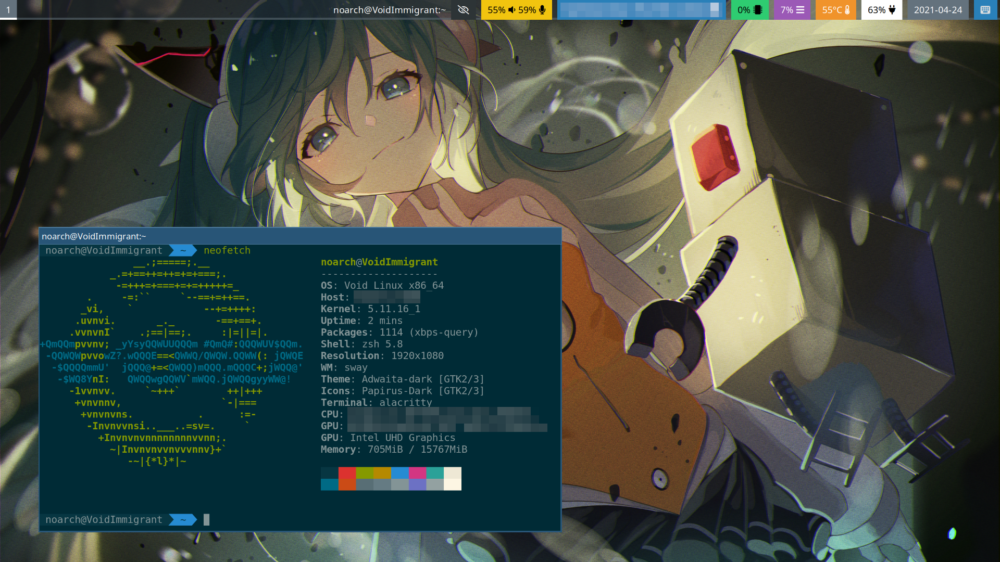

# noarch's dotfiles

Configuration files for noarch's laptop.

No crazy eye-candy stuff; generic AF, just works.

## Specs

- Distro: [Void Linux](https://voidlinux.org/) x86_64 glibc
- Window manager: [Sway](https://swaywm.org/)
    - Theme: Adwaita-dark
    - Icons: Papirus-Dark
    - Fonts
        - Normal: Roboto / Noto Sans CJK SC
        - Titles: Noto Sans / Noto Sans CJK SC
- App launcher: [Wofi](https://hg.sr.ht/~scoopta/wofi)
- Terminal: [Alacritty](https://github.com/alacritty/alacritty)
    - Shell: zsh w/ [oh-my-zsh](https://ohmyz.sh/) (just being lazy)
    - Color scheme: Solarized Dark
    - Font: DejaVu Sans Mono
- File manager: Thunar
- Browser: [Firefox](https://www.mozilla.org/en-US/firefox/new/) (rapid release channel)
    - Addons: [uBlock Origin](https://ublockorigin.com/), [ClearURLs](https://clearurls.xyz/), [Greasemonkey](https://www.greasespot.net/), [LocalCDN](https://www.localcdn.org/), [noarch's user.js](https://github.com/noarchwastaken/user.js), [UnDuckButton](https://greasyfork.org/en/scripts/420707-unduckbutton)
- Media player: [mpv](https://mpv.io/)
- Image viewer: [imv](https://github.com/eXeC64/imv)
- Code editor: [Code-OSS](https://github.com/Microsoft/vscode)
- Other stuff
    - [fcitx5](https://github.com/fcitx/fcitx5)[-rime, -anthy]
    - [PipeWire](https://pipewire.org/), replacing PulseAudio
    - [unbound](https://nlnetlabs.nl/projects/unbound/about/), with [StevenBlack's hosts](https://github.com/StevenBlack/hosts/)

## Wallpaper

Located at `Pictures/bg.jpg`.

